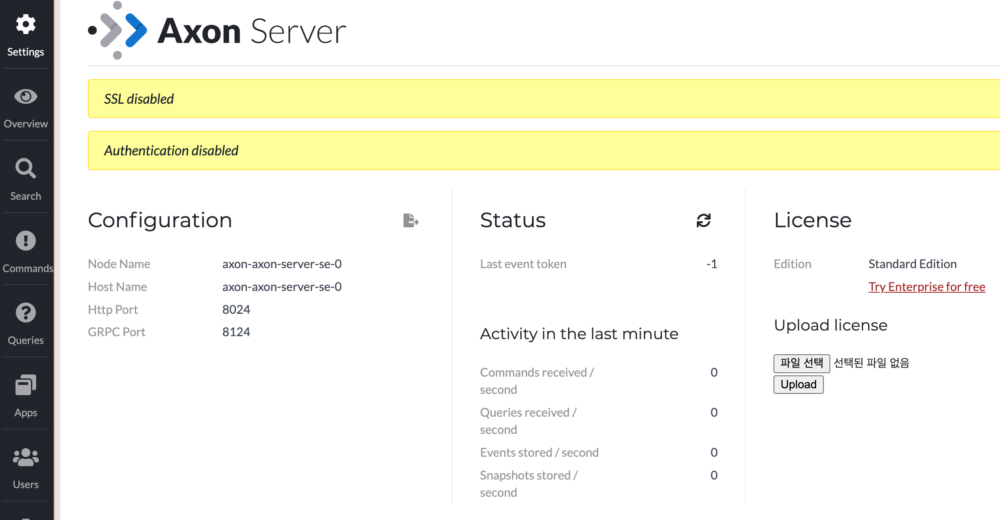

# Running Axon Server
AxonIQ에서 제공하는 Axon server 배포 가이드에서 helm chart부분을 수정하였습니다.  
원본은 아래 주소에 있습니다. 3-k8s > 5-helm-se > axon-server-se를 참고하세요.  
[Running Axon Server](https://github.com/AxonIQ/running-axon-server)

별도로 repository를 만든 이유는 helm chart로 Axon server 배포 시 버그가 있기 때문입니다.

> **수정사항**  
- ingress.yaml을 최신 k8s 규약에 맞도록 수정
- statefulset에서 livenessProbe와 readinessProbe를 활성화 여부를 묻는 옵션 추가.
- 배포정의 파일 axon.yaml 추가

> **배포 방법**  
- Download할 머신에 directory만들기 
```
ex) mkdir ~/install && cd ~/install 
```
- Clone git repository 
```
git clone https://github.com/happykubepia/axon-server-helm.git  
cd axon-server-helm 
```
- 설치하기 
```
helm install {release name} -f axon.yaml .
ex) helm install axon -f axon.yaml .
```

> **확인하기** 
- 접근할 머신의 hosts 또는 DNS서버에 ingress host 등록 
- 브라우저에서 Ingress주소로 접근 
```
http://myaxon.io
``` 


>**k8s node를 직접 접근 못하는 경우**   
PC에 minikube를 docker로 설치한 경우 또는
k8s node를 private IP로 설치한 경우는  
Service object를 Port forward한 후 접근함. 
- Service Port forward
```
kubectl port-forward svc/axon-axon-server-se-ui {접근Port}:8024 &
ex) kubectl port-forward svc/axon-axon-server-se-ui 18024:8024 &
```
- 브라우저에서 forward한 주소로 접근 
```
ex) http://localhost:18024 
``` 
